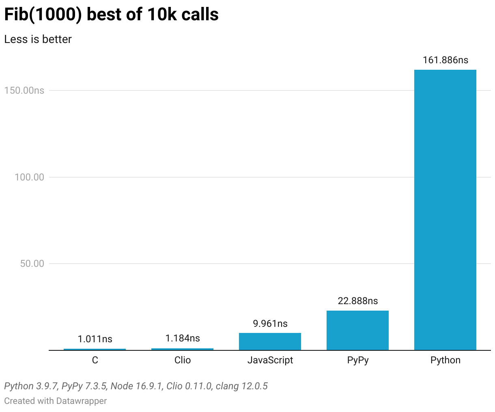

# Clio vs others

This repository implements the fib function in several languages
and measures the execution time for each of them.

## Results



## How to run the...

### C version

```bash
gcc -O3 main.c -o main && ./main
```

Notes: this one runs only on MacOS. Unfortunately I couldn't find a portable way
of getting time in nanoseconds. If you know a way, please make a pull request.

### Clio version

```bash
clio run
```

### JavaScript version

```bash
node index.js
```

### Python version

With Python:

```bash
python3 main.py
```

With PyPy:

```
pypy3 main.py
```
